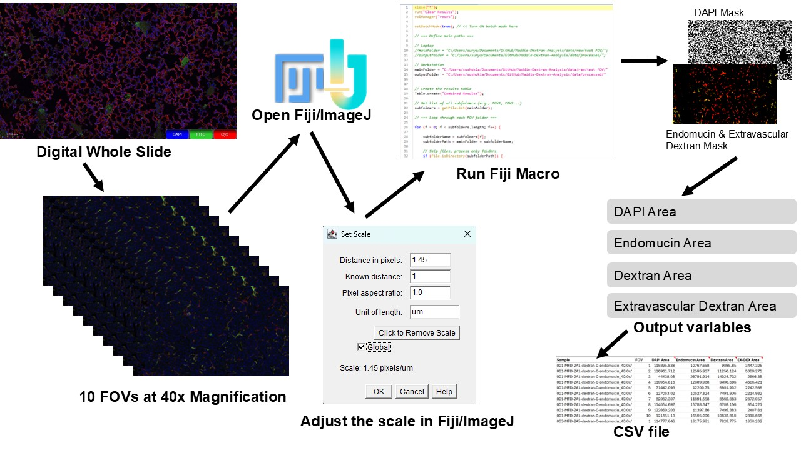

# Dextran Analysis for Vascular Permeability

Dextran analysis is a widely used method to assess vascular permeability in both live and fixed tissue samples. In cancer research, fluorescently labeled dextran acts as a tracer to visualize localized leakage events, particularly around tumor-associated structures such as TMEM (Tumor Microenvironment of Metastasis) sites. By quantifying dextran uptake or leakage, researchers can evaluate vascular integrity, measure treatment response, and study mechanisms of tumor cell intravasation and metastasis.

---

## 📂 Project Overview

This repository provides **Fiji macros** for automated quantification of dextran leakage in fixed tissue images. The pipeline enables high-throughput, reproducible assessment of vascular permeability and TMEM-associated activity across multiple fields of view (FOVs).

---

## ⚙️ Requirements

- [Fiji (ImageJ)](https://imagej.net/software/fiji/)

---

## 🔬 Dextran Quantification Workflow

**Workflow Summary:**
1. Input: Digital whole slide images (multiplexed fluorescence)
2. Preprocessing: Field of view (FOV) extraction at 40×
3. Fiji macro: Batch quantification of signal areas
4. Output: CSV file with DAPI, endomucin, dextran, and extravascular dextran areas

---

## Features

- Automated batch processing using Fiji macros  
- Scale-aware quantification of fluorescent dextran signal  
- Outputs CSV-ready tables for downstream analysis  
- Compatible with fixed tissue sections imaged by confocal or widefield microscopy  

---

## 📚 Reference

This analysis pipeline is based on a methodology similar to that described in the following publication:

> **Karagiannis, G.S., et al.** (2019). *Assessing tumor microenvironment of metastasis doorway-mediated vascular permeability associated with cancer cell dissemination using intravital imaging and fixed tissue analysis*.  
> **Journal of Visualized Experiments**, (148), e59449.  
> [https://doi.org/10.3791/59449](https://doi.org/10.3791/59449)

The Fiji macro in this repository implements comparable quantification strategies to those used in the study above, enabling assessment of TMEM-mediated vascular permeability using fixed tissue imaging.

---

## 📖 How to Cite

If you use this software in your research or analysis, please cite the following:

> **Suryansh Shukla. (2025).** *suryanshshukla10/Dextran_Analysis: v1.0*. Zenodo. [https://doi.org/10.5281/zenodo.15866303](https://doi.org/10.5281/zenodo.15866303)

You can also export the citation in BibTeX, EndNote, or other formats from the [Zenodo page](https://doi.org/10.5281/zenodo.15866303).

---
